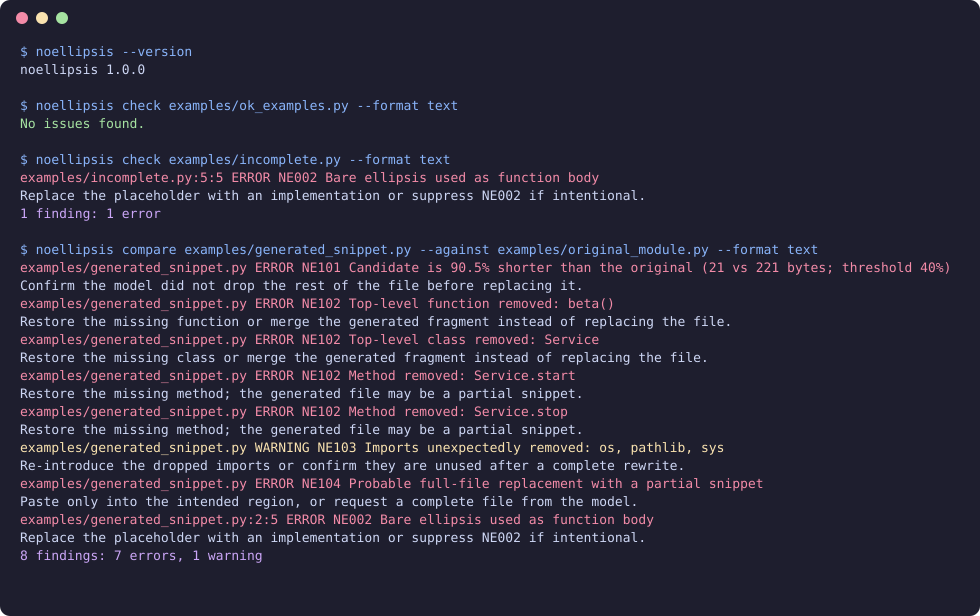

# NoEllipsis

[](https://github.com/hoodbroskillson/NoEllipsis/actions/workflows/ci.yml)
[](https://github.com/hoodbroskillson/NoEllipsis/releases)
[](https://www.python.org/downloads/)
[](LICENSE)

A fast, **local** CLI that detects incomplete or dangerously truncated LLM-generated code **before** you paste, commit, or deploy it.

NoEllipsis is a deterministic static checker. It does **not** call a model, does **not** need an API key, and **never** uploads your source. It never executes the files it scans and never changes Git state.

It is **not** an AI-content detector, a full compiler, a vulnerability scanner, a rewriter, or a hosted service.



## 30-second demo

```bash
python -m pip install "noellipsis @ git+https://github.com/hoodbroskillson/NoEllipsis.git@v1.0.0"
noellipsis --version
noellipsis check examples/ok_examples.py --format text
noellipsis check examples/incomplete.py --format text
noellipsis compare examples/generated_snippet.py --against examples/original_module.py --format text
```

A clean file prints `No issues found.` An unfinished function reports `NE002` and a one-line count such as `1 finding: 1 error`. Compare reports shrink / removed-symbol rules (`NE101`–`NE104`) plus any placeholders in the candidate.

The image above is a static terminal snapshot generated from real CLI output (see `docs/demo.tape`). It is not an animated GIF.

## Install

Requires Python 3.11+. There is no PyPI package; install from the git tag:

```bash
python -m pip install "noellipsis @ git+https://github.com/hoodbroskillson/NoEllipsis.git@v1.0.0"
```

Then:

```bash
noellipsis --help
python -m noellipsis --help
```

Local development:

```bash
python -m pip install -e ".[dev]"
ruff check .
pytest -q
```

The `dev` extra includes pytest, ruff, build, and twine. Runtime dependencies remain empty.

## Commands

Shared options may appear **before or after** the subcommand:

```bash
noellipsis --format json check src/
noellipsis check src/ --format json
noellipsis --fail-on warning compare candidate.py --against original.py
noellipsis compare candidate.py --against original.py --fail-on warning
noellipsis --format github git-diff --staged
noellipsis git-diff --staged --format github
```

### `noellipsis check FILE_OR_DIRECTORY`

Scan a file or a tree. Default excludes include `.git`, virtualenvs, `node_modules`, `vendor`, `dist`, `build`, coverage output, `__pycache__`, minified JS, and common binaries.

```bash
noellipsis check src/
noellipsis check examples/incomplete.py --format text
```

### `noellipsis compare GENERATED --against ORIGINAL`

Compare a model’s candidate against the file it was supposed to edit. Reports percent size reduction, removed top-level functions/classes/methods, removed imports, snippet-as-replacement, and any placeholders the candidate introduced.

```bash
noellipsis compare examples/generated_snippet.py --against examples/original_module.py
```

### `noellipsis git-diff` / `noellipsis git-diff --staged`

Inspect **added** lines in the working-tree (or staged) diff. Requires a Git repository. Uses `subprocess.run` with an argument list and `shell=False`. Does not stage, commit, reset, restore, or checkout anything.

```bash
noellipsis git-diff
noellipsis git-diff --staged --format github
```

Outside a repository the command exits `2` with a clear error.

## Options

| Option | Meaning |
| --- | --- |
| `--format text\|json\|github` | Human text, stable JSON, or GitHub Actions annotations |
| `--fail-on error\|warning` | Minimum severity that yields exit code `1` |
| `--exclude PATTERN` | Extra glob (repeatable) |
| `--disable RULE_ID` | Turn off a rule (repeatable) |
| `--shrink-threshold 40` | Percent shrinkage that triggers NE101 (integer 0–100) |
| `--verbose` | Progress on stderr |

Invalid CLI flags or invalid `[tool.noellipsis]` values print a clear error and exit `2`.

### Exit codes

| Code | Meaning |
| --- | --- |
| `0` | Nothing at or above `--fail-on` |
| `1` | One or more findings at or above the threshold |
| `2` | Invalid arguments, invalid config, unreadable path, not a git repo, or internal error |

## Rules

| ID | Default | What it catches |
| --- | --- | --- |
| **NE001** | error | Placeholder phrases in **real comments** (`Rest of code unchanged`, `Insert your code here`, stub-like `TODO`/`FIXME`) |
| **NE002** | error | Bare ellipsis / incomplete body. A Python function whose **entire** body is `...` is an error |
| **NE003** | warning | `pass`-only (or `raise NotImplementedError`-only) function, unless abstract or clearly intentional |
| **NE004** | error | Unclosed Markdown code fence |
| **NE005** | error | Unbalanced `()`, `[]`, `{}` via a state machine that skips strings and comments |
| **NE006** | error | Python syntax error / truncated statement (`ast.parse`) |
| **NE007** | error | Unresolved merge-conflict markers |
| **NE101** | error | Candidate dramatically shorter than the original (default 40% smaller) |
| **NE102** | error | Top-level function, class, or method removed |
| **NE103** | warning | Imports unexpectedly removed |
| **NE104** | error | Probable full-file replacement with a partial snippet |

Each finding includes: rule id, severity, file, line (when known), a short explanation, and a suggested next action.

## What NoEllipsis deliberately does **not** flag

These are regression-tested:

- `print("...")`
- `const copy = [...items];` and `function collect(...args) {}`
- Prose such as `Wait... what happened?`
- URLs and quoted documentation
- Placeholder-looking text inside docstrings, JS/TS templates, Go raw strings, Rust raw strings, and shell heredocs
- Intentional Python `@abstractmethod` / `Protocol` stubs
- `.pyi` stub files
- Empty constructors (`def __init__(self): pass`)
- JavaScript spread / rest (`...args`)

Language support: **strong AST for Python**. Conservative heuristics for JS/TS/JSX/TSX, Java, Go, Rust, C/C++, C#, Ruby, PHP, Shell, and Markdown. Prefer a miss over a false positive.

A shared lexer classifies **code / string / comment** regions. Suppression phrases and placeholder detection look at comments only. The tool never executes scanned code.

## Configuration

`pyproject.toml`:

```toml
[tool.noellipsis]
shrink-threshold = 40
fail-on = "error"
exclude = ["vendor/**", "generated/**"]
disable = ["NE103"]
```

See `noellipsis.example.toml`. CLI flags override the file.

## Suppressions

Works in real comments (`#`, `//`, `/* */`, `<!-- -->`). Phrases inside strings or docstrings never suppress.

```python
def experimental():
    ...  # noellipsis: ignore[NE002]
```

```python
# noellipsis: ignore-file
```

Multiple ids: `noellipsis: ignore[NE002,NE003]`.

## pre-commit

```yaml
repos:
  - repo: https://github.com/hoodbroskillson/NoEllipsis
    rev: v1.0.0
    hooks:
      - id: noellipsis
```

The hook runs `noellipsis git-diff --staged` with no filename arguments and does not mutate Git. Exit codes match the table above.

## GitHub Actions

```yaml
- uses: actions/checkout@v4
- uses: actions/setup-python@v5
  with:
    python-version: "3.12"
- run: python -m pip install "noellipsis @ git+https://github.com/hoodbroskillson/NoEllipsis.git@v1.0.0"
- run: noellipsis git-diff --format github
```

This repository’s own CI is `.github/workflows/ci.yml`. Releases from `v*.*.*` tags attach a wheel and sdist on GitHub; they are **not** published to PyPI.

## Output

Text:

```
src/example.py:84:5 ERROR NE002 Bare ellipsis used as function body
  Replace the placeholder with an implementation or suppress NE002 if intentional.
1 finding: 1 error
```

A clean scan prints `No issues found.`

GitHub Actions (special characters in paths and messages are escaped):

```
::error file=src/example.py,line=84,col=5::NE002 Bare ellipsis used as function body
```

JSON is deterministic (sorted keys, findings ordered by file / line / rule).

## Limitations (honest)

- Not a type checker, compiler, formatter, or security scanner.
- Not an AI-content detector and will not tell you whether a human wrote a file.
- Heuristics for non-Python languages miss some syntax and ignore some comments inside unusual constructs.
- `--shrink-threshold` compare is byte-size based; a shorter-but-complete rewrite can still trip NE101.
- False positives should be reported as issues with a minimal file. Prefer a suppression over loosening a rule globally.

## Safety / privacy

- No network requests at runtime
- No evaluation or `exec` of scanned files
- Scanned files are never modified
- Git is read-only (`git rev-parse`, `git diff`)
- Runs entirely on the machine you invoke it on

## License

MIT © 2026 hoodbroskillson
